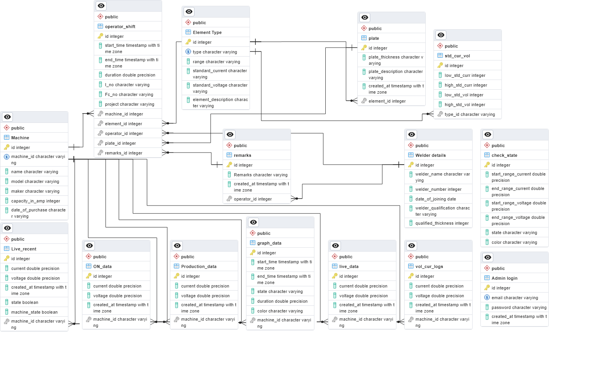

# Introduction

In this system's backend architecture, Python serves as the primary language, FastAPI facilitates API services, while PostgreSQL handles the database and its management.

### Prerequisites

1. install python
   
2. install pycharm or visual studio code 

3. install PostgreSQL

###Database

For data storage and management, PostgreSQL was employed as the database system, and an Entity-Relationship Diagram (ERD) illustrating the relationships between all the tables is provided below.

  

#### Tables in the Database

1. **"Admin login"**
      - Manages administrative login credentials. 
      - Fields: email, password, created_at.

2. **"Element Type"**
      - Categorizes different types of elements.
      - Fields: type, range, standard_current, standard_voltage, element_description.

3. **"Live_recent"**
      - Stores real-time data including current, voltage, timestamps, and machine state.
      - Fields: current, voltage, created_at, state, machine_state, machine_id.

4. **"Machine"**
      - Stores machine details such as ID, name, model, maker, capacity_in_amp, date_of_purchase.
      - Fields: machine_id, name, model, maker, capacity_in_amp, date_of_purchase.

####Foreign Keys in Tables

1. **"Live_recent"**
      - Foreign Key: "Live_recent_machine_id_fkey"
      - References: "Machine" table's "machine_id" column.

2. **"ON_data"**
      - Foreign Key: "ON_data_machine_id_fkey"
      - References: "Machine" table's "machine_id" column.

3. **"Production_data"**
      - Foreign Key: "Production_data_machine_id_fkey"
      - References: "Machine" table's "machine_id" column.

4. **"graph_data"**
      - Foreign Key: "graph_data_machine_id_fkey"
      - References: "Machine" table's "machine_id" column.

5. **"live_data"** and **"vol_cur_logs"**
      - Foreign Keys: "live_data_machine_id_fkey" and "vol_cur_logs_machine_id_fkey"
      - References: "Machine" table's "machine_id" column.

6. **"operator_shift"**, **"plate"**, **"std_cur_vol"**, and **"remarks"** Tables
      - Include foreign key constraints referencing specific columns in other tables for data integrity and consistency.
  
###Technical stack
#### Packages to be installed
The following is a comprehensive list of packages utilized and required for the backend services:
             
    annotated-types==0.5.0
    anyio==3.7.1
    bcrypt==4.0.1
    cffi==1.15.1
    click==8.1.6
    colorama==0.4.6
    cryptography==41.0.3
    distro==1.8.0
    dnspython==2.3.0
    ecdsa==0.18.0
    email-validator==2.0.0.post2
    fastapi==0.100.1
    greenlet==2.0.2
    h11==0.14.0
    idna==3.4
    passlib==1.7.4
    psycopg2==2.9.6
    pyasn1==0.5.0
    pycparser==2.21
    pydantic==2.1.1
    pydantic-settings==2.0.3
    pydantic_core==2.4.0
    python-dotenv==0.21.1
    python-jose==3.3.0
    python-multipart==0.0.6
    rsa==4.9
    six==1.16.0
    sniffio==1.3.0
    SQLAlchemy==2.0.19
    starlette==0.27.0
    toml==0.10.2
    typing_extensions==4.7.1
    uvicorn==0.22.0

####Project layout
    
    main.py                        # The main entry point for the fastapi backend application.

    background_tasks.py            # This handles the background tasks for live data 
                                   # handling idle and production data

    graph_tasks.py                 # This consists of the logic for handling the live data 
                                   # for the graph

    main_machine_monitoring/       
    ├── database                   # This python package consist of modules related to database.
    │     ├── db_setup.py          # This module contains the connections for the database  
    │     ├── orm_class.py         # This module consists of the ORM module of the tables
    │
    ├── pydantic_schema             
    │     ├── request_schema.py    # This python module consist of pydantic modules which are
    │                              # used for the response body.
    │  
    └── routers                    # This python package consist of all the API endpoints.

### FastAPI endpoints through swagger

* To verify the endpoints, the initial step is to execute the following command in the terminal
  
        uvicorn main:app --reload --host <ip_address> --port <port_number>

* After executing the command, proceed to open any web browser and enter the specified IP address and port number provided in the command followed by '/docs'.

        <ip_address>:<port_number>/docs

### FastAPI CRUD Operations Guide

#### Import Necessary Modules

    from fastapi import FastAPI, HTTPException
    from pydantic import BaseModel
    from typing import List
    
    app = FastAPI()

####Define a Pydantic Model

Create a Pydantic model to define the structure of the data.

**Example:**

    class Item(BaseModel):
        name: str
        description: str = None

####1. Create (POST) - Add a New Item

**Endpoint:** POST /items/
   
**Description:** This endpoint allows you to add a new item to the collection.
    
**Example Request Body:**
                              
    {
    "name": "Example Item",
    "description": "This is an example item."
    }

**Implementation:**
  
    @app.post("/items/", response_model=Item)
    async def create_item(item: Item):
    items_db.append(item)
    return item

####2. Read (GET) - Retrieve a List of Items

**Endpoint:** GET /items/
   
**Description:** This endpoint retrieves a list of all items in the collection.

**Implementation:**
  
    @app.get("/items/", response_model=List[Item])
    async def read_items():
    return items_db

####3. Read (GET) - Retrieve a Single Item by ID

**Endpoint:** GET /items/{item_id}
   
**Description:** This endpoint retrieves a single item from the collection based on its ID.

**Example Request:** GET /items/0

**Implementation:**

    @app.get("/items/{item_id}", response_model=Item)
    async def read_item(item_id: int):
    if item_id < 0 or item_id >= len(items_db):
    raise HTTPException(status_code=404, detail="Item not found")
    return items_db[item_id]

####4. Update (PUT) - Update an Existing Item

**Endpoint:** PUT /items/{item_id}
   
**Description:** This endpoint allows you to update an existing item in the collection.
    
**Example Request Body:**
                              
    {
      "name": "Updated Item",
      "description": "This item has been updated."
    }

**Implementation:**
  
    @app.put("/items/{item_id}", response_model=Item)
    async def update_item(item_id: int, updated_item: Item):
    if item_id < 0 or item_id >= len(items_db):
    raise HTTPException(status_code=404, detail="Item not found")
    items_db[item_id] = updated_item
    return updated_item

####5. Delete (DELETE) - Delete an Item

**Endpoint:** DELETE /items/{item_id}
   
**Description:** This endpoint allows you to delete an item from the collection based on its ID.

**Example Request:** DELETE /items/1

**Implementation:**

    @app.delete("/items/{item_id}", response_model=Item)
    async def delete_item(item_id: int):
    if item_id < 0 or item_id >= len(items_db):
    raise HTTPException(status_code=404, detail="Item not found")
    deleted_item = items_db.pop(item_id)
    return deleted_item

### Usage of JWT tokens 

Upon client authentication with valid credentials, the API issues a JWT token. Now, the client uses this token in its further requests. 
When the token is sent back to the API, it'll verify if the token is valid then allow the access to requested data

      Client                                       API
         |                                          |
         |       /login(username + password)        |
         | ---------------------------------------> | If the credeantials valid, sends the token
         |        {JWT Token}                       |
         | <--------------------------------------- |
         |       /post{JWT Token}                   |
         | ---------------------------------------> | Verify if token is valid
         |       Data                               |
         | <--------------------------------------- |

#### Post end point for the token 
 **Authentication/login** : This end point is used to login a user and give JWT token for the session.

  * **Request Body**

          {
              "username": "user_name",
              "password": "user_password"
          }

   * **Response Body**

          {
               "access_token": "eyJhbGciOiJIUzI1NiIsInR5cCI6IkpXVCJ9",
               "token_type": "bearer"
          }

   In the response body 

         {
               "access_token": "JWT Token",
               "token_type": "type of the token"
         }

### Usage of WebSockets
In the context of live data presentation, WebSockets enable a persistent, bidirectional connection that remains open until either the server or the client decides to close it.

####Key Features
* **Persistent Connection**: Unlike traditional HTTP requests, WebSockets maintain an open connection throughout the session, allowing for continuous and instant data exchange.

* **Real-time Updates**: The bidirectional nature of WebSockets allows the server to push updates to connected clients instantly, ensuring that live data is presented in real-time.

* **Efficient Communication**: WebSockets minimize the overhead associated with repeatedly opening and closing connections for each data request. Once established, the connection persists, reducing latency and improving efficiency.

####How It Works

* **Client Request**: The client initiates the WebSocket connection by sending a request to the server. This request is typically upgraded from a standard HTTP request.

* **Connection Establishment**: Upon receiving the WebSocket request, the server establishes a persistent connection with the client.

* **Bi-Directional Communication**: Both the client and server can send messages to each other at any time during the connection. This facilitates real-time updates and interaction between the two.

* **Continuous Data Flow**: Live data that is live current and voltage values, are seamlessly transmitted over the open WebSocket connection.

* **Connection Closure**: The connection remains open until either the server or the client decides to close it. This allows for dynamic control over the duration of the live data presentation session.

####Closing the Connection

* **Client-Side Closure**: The client can send a close frame to the server, indicating the intention to end the connection.

* **Server-Side Closure**: Alternatively, the server can initiate the closure of the WebSocket connection, signaling to the client that the live data presentation session has concluded.

####Endpoint for websocket
        
    ws://localhost/live_recent_ws

*Location of the websocket*:

The main functionality involving Websockets is implemented in the  *'main.py'*  file, refer to this file to understand the integration and usage of Websockets within the project.

