# Introduction
**Project Overview: IoT Based Data Acquisition And Machine Monitoring For Welding Machine[GerbIndia]**

[//]: # (- **Overview of the project:**)

[//]: # (  Briefly describe the purpose, scope, and key features of the software project.)

[//]: # (- **Purpose and objectives:**)

[//]: # (  Clarify the goals and objectives the software aims to achieve.)

[//]: # (- **Target audience:**)

[//]: # (  Identify the intended users and stakeholders.)

## Frontend Technologies
### Frontend Stack Overview

  - The project's frontend utilizes a modern tech stack including **HTML5**  for markup, **CSS3** for styling, **Tailwind CSS** for utility-first styling, **JavaScript** for scripting, **Vue3.js** as the JavaScript framework, and **Axios** for handling HTTP requests.

## Prerequisites
### Creating a Vue 3 Project
  To create a Vue 3 project, you can use the Vue CLI (Command Line Interface), which is a standard tool for Vue.js development. Follow these steps:

1. **Install Node.js and npm:**
     - Before creating a Vue project, ensure that you have Node.js and npm (Node Package Manager) installed on your machine. You can download and install them from [https://nodejs.org/](https://nodejs.org/).
   
2. **Install Vue CLI:**

     - Open a terminal or command prompt and install the Vue CLI globally by running the following command:

               npm install -g @vue/cli

3. **Create a New Project:**
     - Navigate to the directory where you want to create your Vue 3 project using the cd command.
     - Run the following command to create a new Vue 3 project:

               vue create project-name

4. **Configure Project Settings:**

     - The Vue CLI will prompt you to pick a preset.
     - Choose "Default ([Vue 3] babel, eslint)" for a project with Vue 3, Babel, and ESLint.
     - Alternatively, you can manually select features based on your project requirements.

5. **Project Initialization:**
      - Once the project is created, navigate into the project directory:

            cd project-name

6. **Run the Development Server:**
      - To start the development server and see your project in action, run:

            npm run serve

7. **Explore and Customize:**
    - Open the project in your preferred code editor.
    - Explore the **`src`** directory where your main application code is located.
    - Customize the project according to your needs by modifying components, adding new features, and integrating external libraries.

### Adding Tailwind CSS to Vue 3 Project:
 To add Tailwind CSS to a Vue 3 project created with the Vue CLI, you can follow these steps:

  1. **Install Tailwind CSS and its Dependencies:**
     - Open a terminal in the root of your Vue 3 project.
     - Install Tailwind CSS, PostCSS, and Autoprefixer by running the following command:

            npm install -D tailwindcss postcss autoprefixer

  2. **Generate Tailwind Configuration Files:**
     - Create a configuration file for Tailwind CSS by running:
     
             npx tailwindcss init -p
     - This will generate a tailwind.config.js file and a postcss.config.js file in your project's root directory.
     
  3. **Configure PostCSS:**
     - Open the postcss.config.js file and ensure it includes the following plugins:

             module.exports = {
               plugins: {
                  tailwindcss: {},
                  autoprefixer: {},
               }
             }
     
  4. **Create Styles Entry Point:**
     - Create a new file, for example, **`src/styles/tailwind.css`** to serve as your styles entry point.

             /* src/styles/tailwind.css */

             @import 'tailwindcss/base';
             @import 'tailwindcss/components';
             @import 'tailwindcss/utilities';
     
  5. **Import Tailwind CSS in Main Styles File:**
     - Open your main styles file, usually src/assets/styles/main.css, and import the Tailwind CSS styles:
     
             /* src/assets/styles/main.css */

              @import './tailwind.css';
     
              /* Your existing styles go here */

  6. **Update Build Configuration:**
     - Open **`vue.config.js`** in the root of your project (create it if it doesn't exist) and add the following configuration:

               // vue.config.js
               module.exports = {
                 css: {
                   loaderOptions: {
                      postcss: {
                        plugins: [
                           require('tailwindcss'),
                           require('autoprefixer'),
                        ],
                      },
                   },
                 },
               }
     
  7. **Use Tailwind CSS Classes:**
     - You can now use Tailwind CSS classes in your Vue components. For example, in your Vue component's template:
    
                 <template>
                    

                     This is a Tailwind CSS component!
                    

                 </template>

  8. **Run the Development Server:**
     - Start or restart your development server:

                  npm run serve

## File Structure

In Vue.js 3, the file structure is flexible and depends on the complexity and requirements of your project. However, there are common conventions that you can follow to organize your Vue.js project in a clean and maintainable way. Here's a step-by-step explanation of a typical file structure for a Vue.js 3 project:

1. **Project Root:**
    - At the root of your project, you might find configuration files like **`package.json`**, **`babel.config.js`**, and **`vue.config.js`**.
2. **src Folder:**
    - The **`src`** folder is where your main source code resides.

3. **Assets:**
    - The **`assets`** folder contains static assets like images, fonts, and stylesheets.

             src/
               |- assets/
                    |- images/
                          |- ak400.png
                    |- styles/

         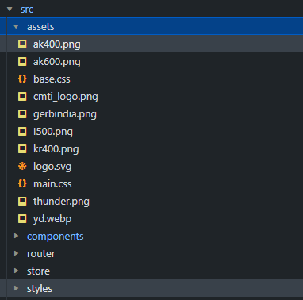

4. **Components:**
    - The **`components`** folder is where you store your Vue components. You can organize them further based on features or functionalities.

              src/
                |- components/
                     |- elementMaster.vue
                     |- filterTable.vue
                     |- welder.vue
                     |- ...

         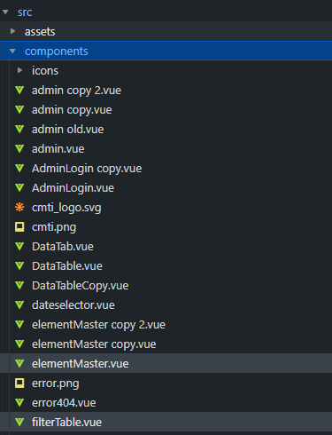

5. **Views/Pages:**
    - The **`views`** or **`pages`** folder is where you store higher-level components that represent pages or views in your application.

               src/
                 |- views/
                      |- Home.vue
                      |- elementMasterTable.vue
                      |- weldertable.vue
                      |- ...

         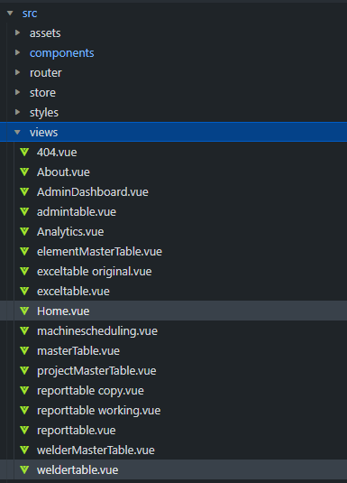

6. **Router:**
    - If you're using Vue Router for navigation, you might have a **`router`** folder to manage your routes.

                src/
                  |- router/
                       |- index.js

         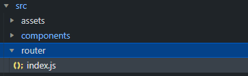 

7. **Store (State Management):**
    - If you're using Vuex for state management, you might have a store folder.
 
                src/
                  |- store/
                       |- index.js
                  |- modules/

         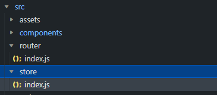

8. **Plugins:**
    - The **`plugins`** folder can contain Vue plugins or third-party integrations.

                 src/
                   |- plugins/
                        |- axios.js

         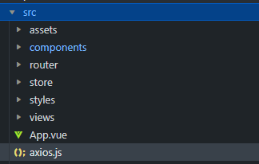

## Commands

* `npm run dev` - Start the development server and run the Vue 3 project.
* `npm run build` - Build the Vue 3 project for production deployment.

## Implementation 
Certainly! Now, I will provide an explanation for the functionalities of each component:

### How to generate a component and its corresponding syntax.
1. **Creating a Basic Component:**
    - Start by creating a new **`.vue`** file, for example, **`MyComponent.vue`**.

                <!-- MyComponent.vue -->

                <template>
                   

                    <!-- Your component's template goes here -->
                     <h1>{{ message }}</h1>
                    

                </template>

                

                

2. **Vue Component Syntax Breakdown:**
    - **`<template>:`** Contains the HTML structure of the component.
    - **`<script>:`** Contains the JavaScript code for the component.
    - **`<style>:`** Contains the component's styles (use scoped attribute to scope styles to the component).

        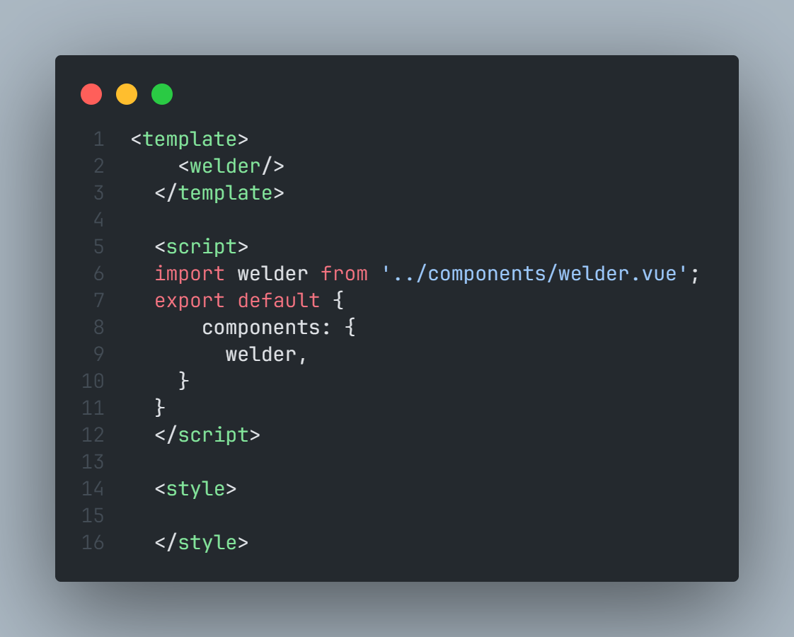

## **Project Functionalities Overview for Welder Page:**

### **`Live Button Functionalities:`**
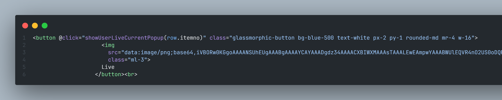

* `Live Button Click Event:` 
    - The `"Live"` button is configured to respond to the click event using the @click directive.
    - When the button is clicked, the `"showUserLiveCurrentPopup"` function is invoked.
* `Function Invocation:` - Build the Vue 3 project for production deployment.
    - The `"showUserLiveCurrentPopup"` function is called with an argument (`row.itemno`).
    - The purpose and functionality of the `"showUserLiveCurrentPopup"` function are determined by the implementation in the Vue.js component or script associated with this template.

      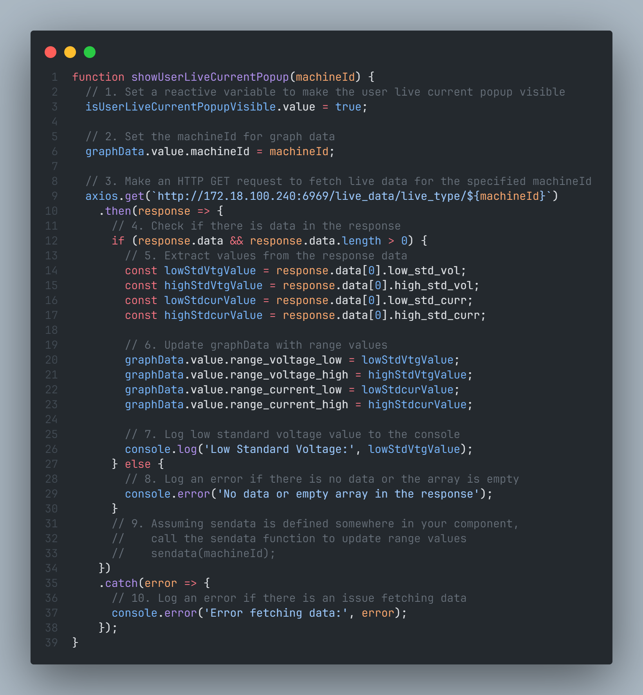
  
    - **`Visibility Toggle:`** 
        - The function sets a reactive variable (`'isUserLiveCurrentPopupVisible'`) to `'true'`, making the user live current popup visible.
    - **`Graph Data Configuration:`** 
        - The `'machineId'` parameter is assigned to the `'graphData'` object, updating the machineId for graph data.
    - **`HTTP GET Request:`** 
        - An Axios HTTP GET request is made to fetch live data for the specified `'machineId'` from a given endpoint.
    - **`Data Validation:`** 
        - Checks if there is data in the response and if the array is not empty.
    - **`Data Extraction:`** 
        - Extracts specific values (low and high standard voltage, low and high standard current) from the response data.
    - **`Graph Data Update:`** 
        - Updates the `'graphData'` object with the extracted range values.
    - **`Console Logging:`** 
        - Logs the low standard voltage value to the console.
    - **`Error Handling:`** 
        - Logs an error if there is no data or the array is empty in the response.
    - **`Assumption:`** 
        - Assumes the existence of a `'sendata'` function, commented out but not implemented, to update range values. The `'sendata'` function is expected to be defined elsewhere in the component.
    - **`Error Logging:`** 
        - Logs an error if there is an issue fetching data from the server.

### **`All Stats Button Functionalities:`**

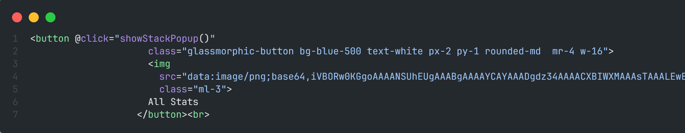

   * `All Stats Button Click Event:` 
      - The `'All Stats'` button is configured to respond to the click event using the `'@click'` directive.
      - When the button is clicked, the `'showStackPopup'` function is invoked.
   * `Function Invocation:` 
      - The `'showStackPopup'` function is called.
      - The purpose and functionality of the `'showStackPopup'` function would be determined by the implementation in the Vue.js component's script.

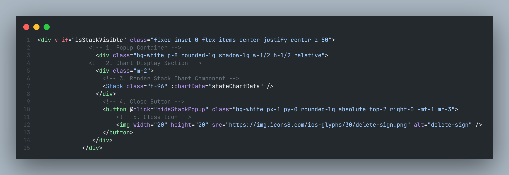

- **`Popup Container:`** 
    - If the `'isStackVisible'` variable is true, display a fixed-positioned container covering the entire screen, centered both vertically and horizontally.
- **`Chart Display Section:`** 
    - Within the container, create a rounded and shadowed section with a white background, providing padding.
- **`Render Stack Chart Component:`** 
    - Inside this section, render a `'Stack'` chart component with a height of 96 units, passing in `'stateChartData'` as a prop.
- **`Close Button:`** 
    - Include a close button at the top-right corner of the container.
- **`Close Icon:`** 
    - The close button contains an `"X"` icon sourced from an external URL, serving as a visual representation of closing the popup.

     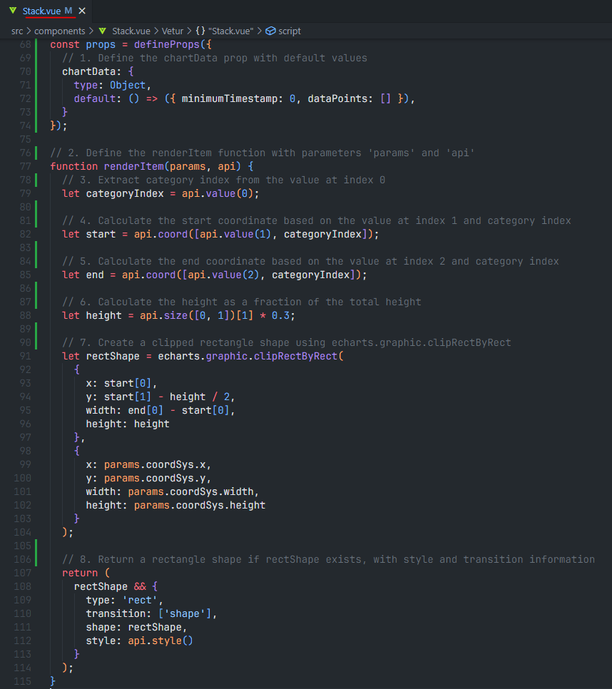

- **`Define Props:`** 
    - The component defines a prop named `'chartData'` with default values representing a chart's minimum timestamp and data points.
- **`Render Item Function:`** 
    - The component has a function named `'renderItem'` that takes parameters `'params'` and `'api'`.
- **`Category Index Extraction:`** 
    - Extract the category index from the value at index 0 using `'api.value(0)'`.
- **`Calculate Start Coordinate:`** 
    - Calculate the start coordinate based on the value at index 1 and the extracted category index.
- **`Calculate End Coordinate:`** 
    - Calculate the end coordinate based on the value at index 2 and the extracted category index.
- **`Calculate Height:`** 
    - Calculate the height as a fraction (30%) of the total height of the chart.
- **`Create Clipped Rectangle Shape:`** 
    - Use echarts.graphic.clipRectByRect to create a clipped rectangle shape based on the calculated start, end, and height.
- **`Return Rectangle Shape:`** 
    - If `'rectShape'` exists, return a rectangle shape with type, transition, shape, and style information.

### **`Production Button Functionalities:`**

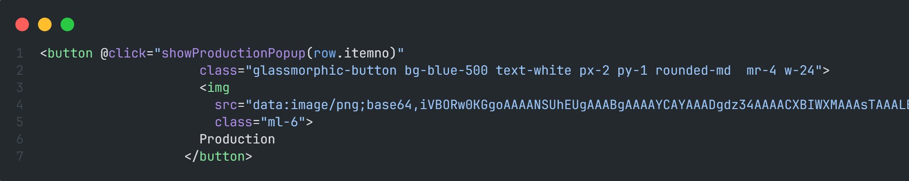

   * `Production Button Click Event:` 
      - The `'Production'` button is configured to respond to the click event using the `'@click'` directive.
      - When the button is clicked, the `'showProductionPopup'` function is invoked.
   * `Function Invocation:` 
      - The `'showProductionPopup'` function is called with an argument (`'row.itemno'`).
      - The purpose and functionality of the `'showProductionPopup'` function would be determined by the implementation in the Vue.js component's script.

     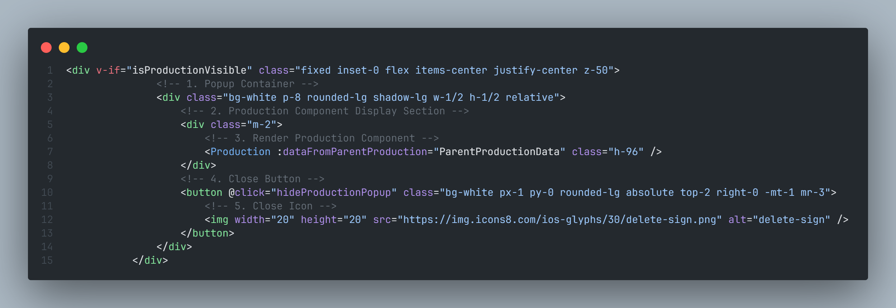

- **`Popup Container:`** 
    - If the `'isProductionVisible'` variable is true, display a fixed-positioned container covering the entire screen, centered both vertically and horizontally.
- **`Production Component Display Section:`** 
    - Within the container, create a rounded and shadowed section with a white background, providing padding.
- **`Render Production Component:`** 
    - Inside this section, render a `'Production'` component with a height of 96 units, passing in `'ParentProductionData'` as a prop.

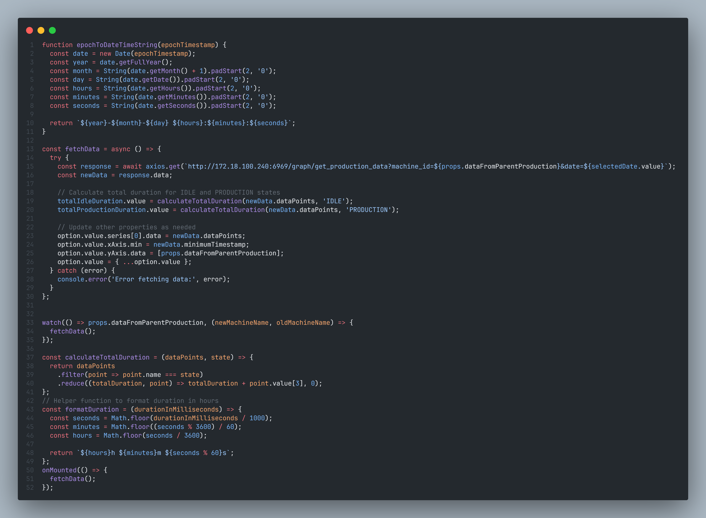

- **`Epoch to DateTime Conversion:`** 
    - The `'epochToDateTimeString'` function converts an epoch timestamp to a formatted date-time string.
- **`Fetch Data Function:`** 
    - The `'fetchData'` function is an asynchronous function that fetches production data using Axios.
- **`Watch for Prop Changes:`** 
    - The `'watch'` function observes changes in the '`dataFromParentProduction`' prop and triggers the `'fetchData'` function accordingly.
- **`Calculate Total Duration:`** 
    - The `'calculateTotalDuration'` function calculates the total duration for a specific state (IDLE or PRODUCTION) based on data points.
- **`Format Duration Function:`** 
    - The `'formatDuration'` function formats a duration in milliseconds into hours, minutes, and seconds. 
- **`Component Mount:`** 
    - The `'onMounted'` lifecycle hook ensures that the `'fetchData'` function is executed when the component is mounted.

### **`Edit/Save Button Functionalities:`**

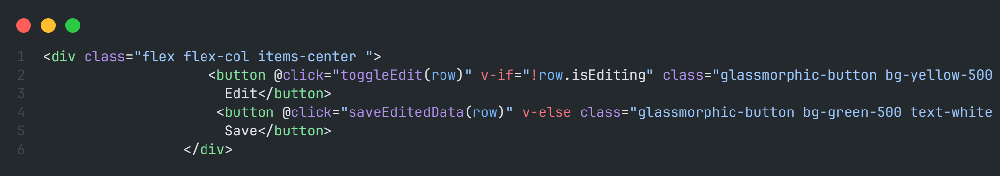

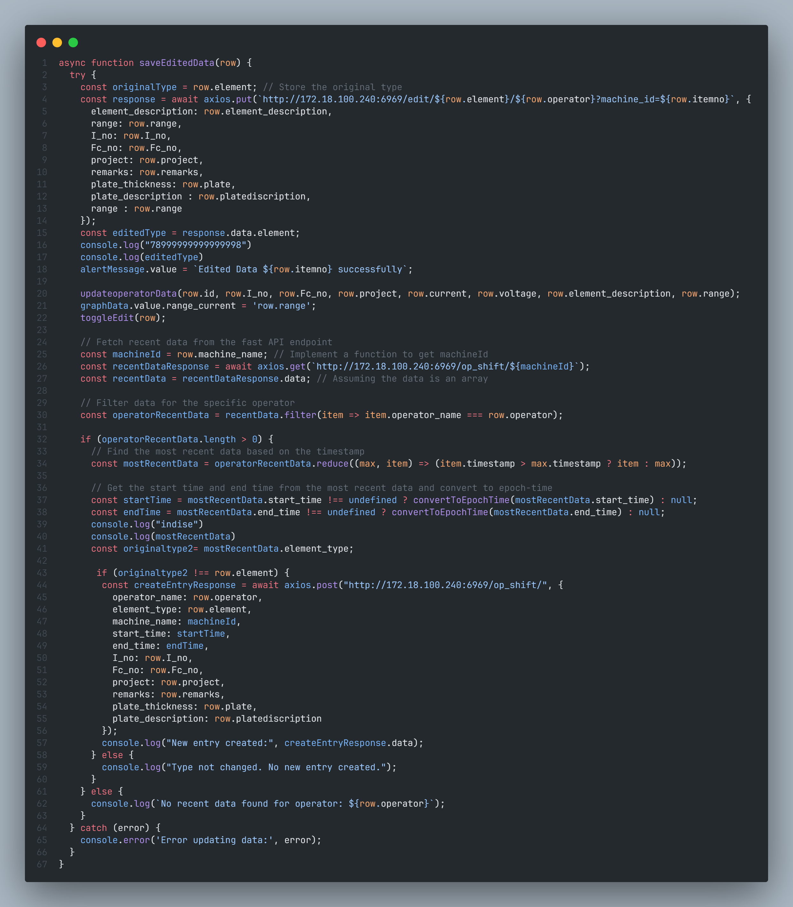

- **`Asynchronous Data Saving Function:`** 
    - The `'saveEditedData'` function is asynchronous and handles the process of saving edited data.
- **`Original Type Storage:`** 
    - The original type of the row is stored before making changes.
- **`HTTP PUT Request for Data Update:`** 
    - An HTTP PUT request is made to update data based on the edited row using the axios library.
- **`Edited Type Extraction:`** 
    - The edited type is extracted from the response data.
- **`Data and Graph Updates:`** 
    - Operator data and graph data are updated based on the edited row.
- **`Toggle Editing Status:`** 
    - The editing status of the row is toggled.
- **`Fetch Recent Data:`** 
    - Recent data is fetched from a FastAPI endpoint for the specific machine and operator.
- **`Filter Data for Operator:`** 
    - Data is filtered for the specific operator.
- **`Most Recent Data Identification:`** 
    - The most recent data entry is identified based on the timestamp.
        1. `Time Conversion to Epoch-Time`: - Start and end times from the most recent data are converted to epoch-time.
- **`Element Type Change Check:`** 
    - Checks if the element type has changed.
- **`HTTP POST Request for New Entry:`** 
    - If the element type has changed, a new entry is created using an HTTP POST request.
- **`Error Handling:`** 
    - Errors during the process are handled and logged.

## Project Functionalities Overview for Machine-Scheduling Page:
### **`Add Machine Button Functionalities:`**
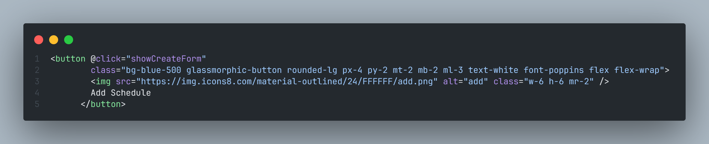

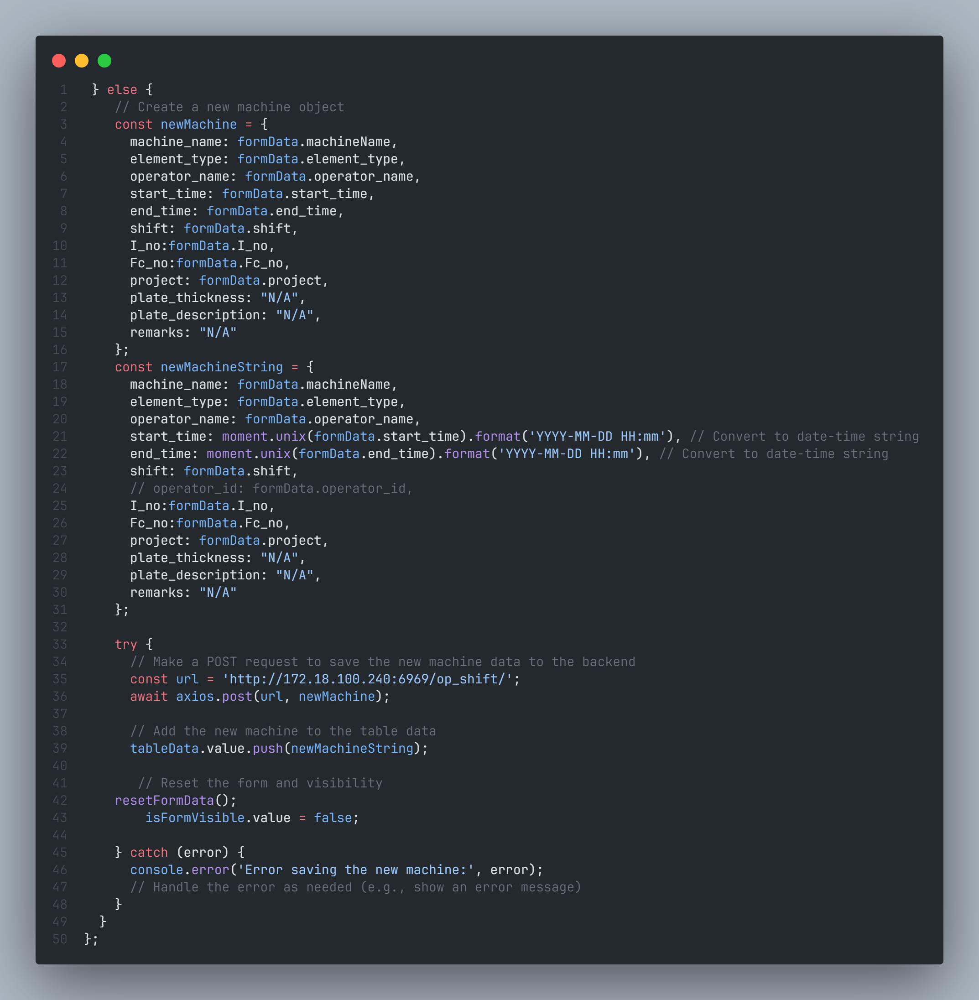

- **`New Machine Object Creation:`** 
    - A new machine object is created with default values based on the form data.
- **`String Version Creation:`** 
    - A string version of the new machine object is created, including formatted date-time strings using the moment library.
- **`HTTP POST Request:`** 
    - An HTTP POST request is made to save the new machine data to the backend using the axios library.
- **`Table Data Update:`** 
    - The new machine, represented as a string, is added to the table data.
- **`Form Reset and Visibility Toggle:`** 
    - The form data is reset, and the visibility of the form is set to false.
- **`Error Handling:`** 
    - Errors during the process are handled and logged, allowing for appropriate error handling (e.g., displaying an error message).

### **`Apply Filter Logic Functionalities:`**
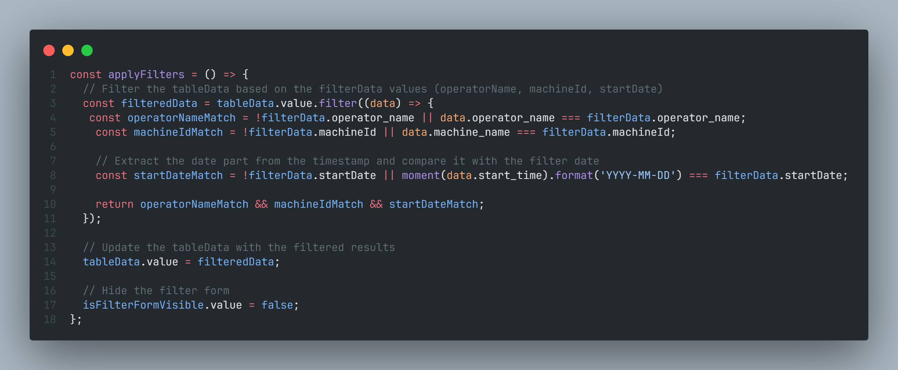

- **`Filtering Process:`** 
    - The function filters the `'tableData'` based on specified filter criteria: `'operatorName'`, `'machineId'`, and `'startDate'`.
- **`Filter Conditions:`** 
    - Checks if there is a match for the operator name, machine ID, and start date based on the provided filter values. If no filter is applied for a specific criterion, it considers it a match.
- **`Date Comparison:`** 
    - Extracts the date part from the timestamp and compares it with the filter date, ensuring a match when the dates are equal.
- **`Resulting Data:`** 
    - Constructs a new array (`'filteredData'`) containing the entries that meet all filter conditions.
- **`Update Table Data:`** 
    - Updates the `'tableData'` with the filtered results, displaying only the entries that match the applied filters.
- **`Hide Filter Form:`** 
    - Sets the visibility of the filter form to false, hiding it after applying the filters.

### **`Download Table Excel Button Functionalities:`**
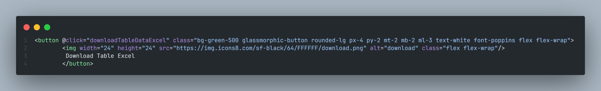

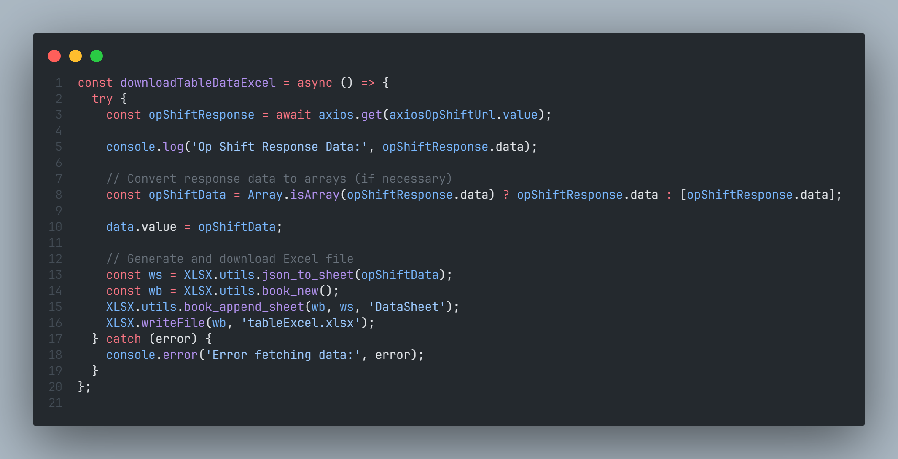

- **`HTTP GET Request:`** 
    - An HTTP GET request is made using Axios to fetch operational shift data.
- **`Console Logging:`** 
    - The fetched operational shift data is logged to the console for verification.
- **`Data Conversion:`** 
    - The response data is converted to an array format, ensuring consistency.
- **`Data Update:`** 
    - TThe reactive data variable (`'data.value'`) is updated with the fetched data.
- **`Excel Sheet Generation:`** 
    - JSON data is converted to an Excel sheet using the XLSX library.
- **`Workbook Creation:`** 
    - A new Excel workbook is created using the XLSX library.
- **`Sheet Appending:`** 
    - The generated sheet is appended to the workbook with the sheet name '`DataSheet`'.
- **`File Writing:`** 
    - The workbook is written to an Excel file named `'tableExcel.xlsx'`.
- **`Error Handling:`** 
    - Errors during the process are handled and logged, allowing for appropriate error handling (e.g., displaying an error message).

### **`Download Production Data Button Functionalities:`**
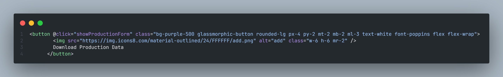

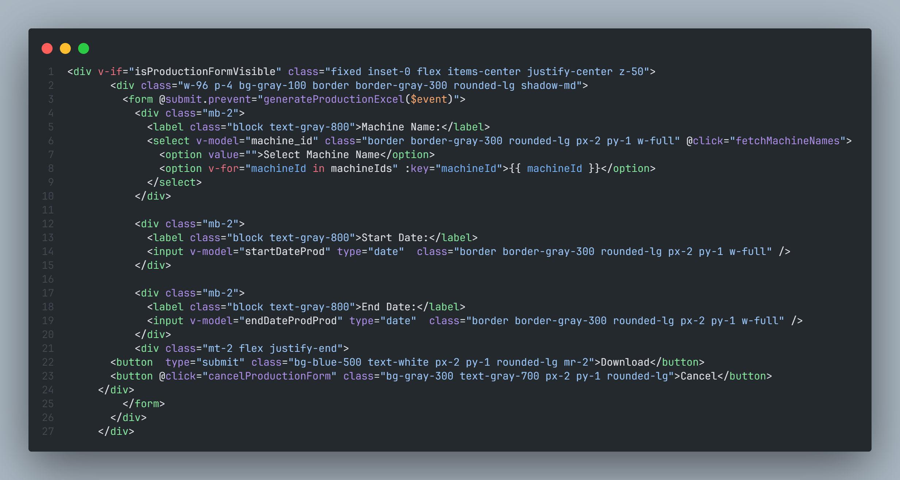

- **`Visibility Toggle:`** 
    - The form is displayed (`'v-if="isProductionFormVisible"'`) in the center of the screen.
- **`Form Structure:`** 
    - The form consists of input fields for selecting a machine name, start date, and end date.
- **`Machine Name Selection:`** 
    - A dropdown menu allows the user to select a machine name, populated dynamically from the `'machineIds'` array.
- **`Start Date Input:`** 
    - An input field for selecting the start date using the `'startDateProd'` variable.
- **`End Date Input:`** 
    - An input field for selecting the end date using the `'endDateProdProd'` variable.
- **`Form Submission Buttons:`** 
    - Two buttons at the bottom of the form:
        - `'Download Button:'`- Triggers the `'generateProductionExcel'` method on form submission.
        - `'Cancel Button:'`- Calls the `'cancelProductionForm'` method to cancel and close the form.
- **`Event Handling:`** 
    - The `'@submit.prevent'` directive prevents the default form submission behavior.
- **`Styling:`** 
    - The form is styled with a specific width, padding, background color, borders, and shadow for a visually appealing layout.

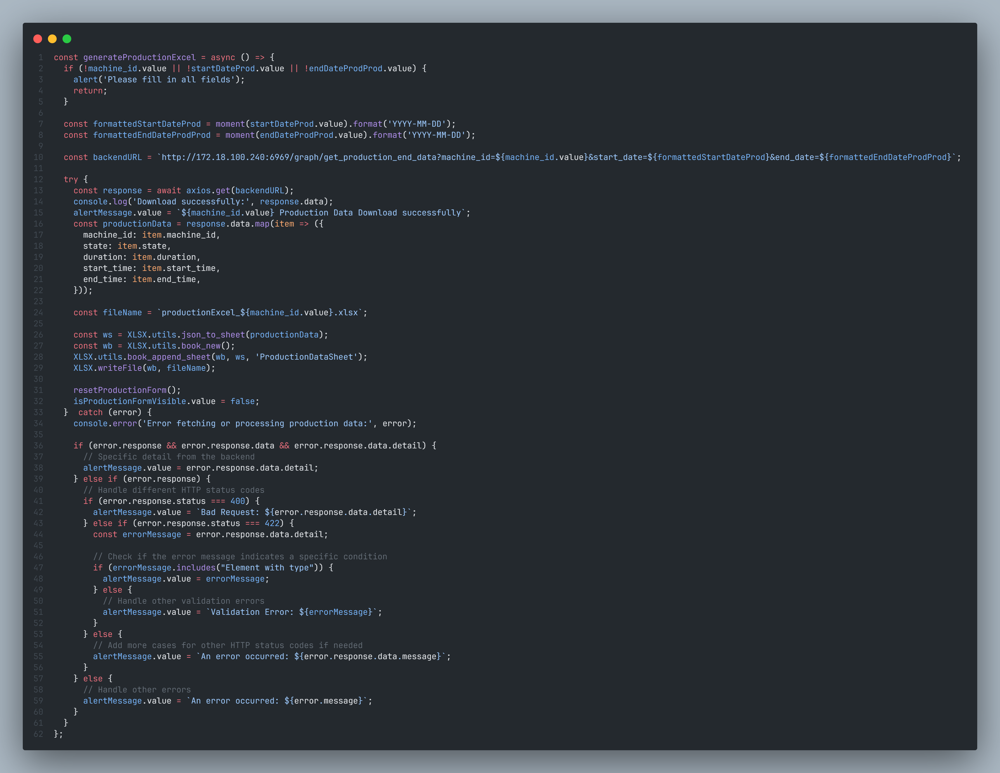

- **`Field Validation:`** 
    - Checks if essential fields (machine ID, start date, and end date) are filled; displays an alert if not.
- **`Date Formatting:`** 
    - Formats the start and end dates using the `'moment'` library.
- **`Backend API URL:`** 
    - Constructs the backend API URL for fetching production data based on the selected machine and date range.
- **`Fetch Production Data:`** 
    - Makes an asynchronous request to the backend to retrieve production data.
- **`Success Handling:`** 
    - If successful, logs the success message, processes the response data, and triggers the download of an Excel file.
- **`Error Handling:`** 
    - Handles errors by providing specific messages based on the type of error, including HTTP status codes and validation errors.
- **`Form Reset and Visibility:`** 
    - Resets the form and hides it after successful data processing and download.

### **`Delete Data Logic Functionalities:`**
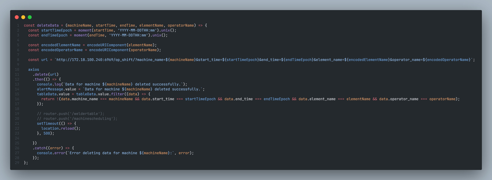

- **`Timestamp Conversion:`** 
    - Converts the start and end times from the input format to Unix timestamps using the `'moment'` library.
- **`URL Encoding:`** 
    - Encodes the element and operator names for safe inclusion in the URL.
- **`URL Construction:`** 
    - Constructs the URL for the DELETE request based on the specified parameters.
- **`DELETE Request:`** 
    - Makes an asynchronous DELETE request to the backend API to delete the specified data.
- **`Success Handling:`** 
    - If successful, logs the success message, updates the table data by removing the deleted entry, and triggers a page reload after a short delay.
- **`Error Handling:`** 
    - Handles errors by logging and displaying an error message in case the deletion fails.

## Project Functionalities Overview for Element-Master Page:
### **`Add Element Type Button Functionalities:`**

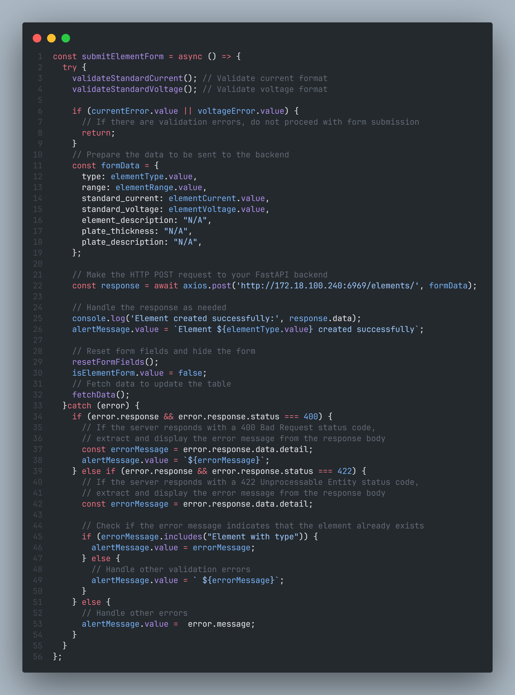

- **`Validation:`** 
    - The function begins by validating the format of both standard current and voltage.
- **`Validation Errors Check:`** 
    - If there are validation errors, the function halts further execution to prevent form submission.
- **`Form Data Preparation:`** 
    - Constructs the form data object with various properties, including type, range, standard current, and standard voltage.
- **`HTTP POST Request:`** 
    - Utilizes axios to make an asynchronous POST request to the FastAPI backend, sending the form data.
- **`Response Handling:`** 
    - Logs a success message and sets an alert message indicating the successful creation of the element.
- **`Form Reset and Visibility:`** 
    - Resets the form fields, hides the form, and triggers a data fetch to update the table.
- **`Error Handling:`** 
    - Catches any errors that may occur during the process and handles them appropriately, displaying relevant error messages.

## Project Functionalities Overview for Report Page:
### **`Filtering Data Functionalities:`**

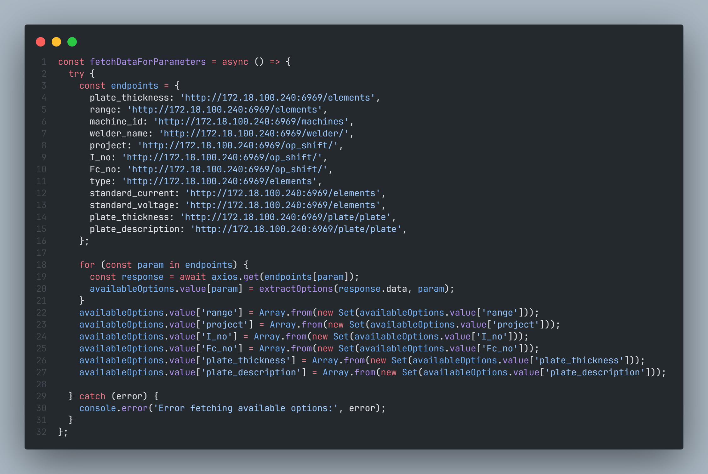

- **`Endpoint Definitions:`** 
    - The function defines various endpoints for different parameters, each representing a specific type of data.
- **`Data Fetching Loop:`** 
    - The function iterates through each parameter in the defined endpoints and makes asynchronous GET requests using axios.
- **`Options Extraction:`** 
    - For each parameter, the response data is extracted using a helper function (`'extractOptions'`) and stored in the `'availableOptions'` object.
- **`Deduplication and Update:`** 
    - Specific parameters in the `'availableOptions'` object, such as 'range,' 'project,' etc., are deduplicated to ensure unique values.
- **`Error Handling:`** 
    - The function includes error handling to log any errors that may occur during the fetching process.

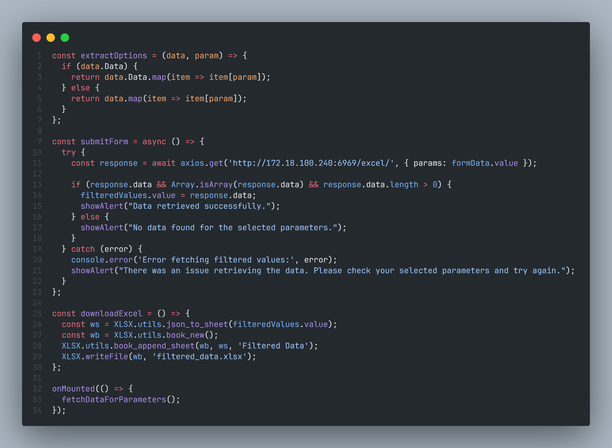

- **`Options Extraction Function:`** 
    - The `'extractOptions'` function is a helper that extracts options from response data based on the specified parameter. It handles different response structures.
- **`Form Submission Function:`** 
    - The `'submitForm'` function makes a GET request to a specified endpoint (`'http://172.18.100.240:6969/excel/'`) with form data as parameters. It checks the response for data and handles success or no-data scenarios.
- **`Excel Download Function:`** 
    - The `'downloadExcel'` function converts filtered values to an Excel sheet using XLSX, appends it to a new workbook, and downloads the workbook as an Excel file.
- **`OnMount Data Fetch:`** 
    - The `'onMounted'` lifecycle hook ensures that the `'fetchDataForParameters'` function is executed when the component is mounted. This function likely populates available options for form parameters.

