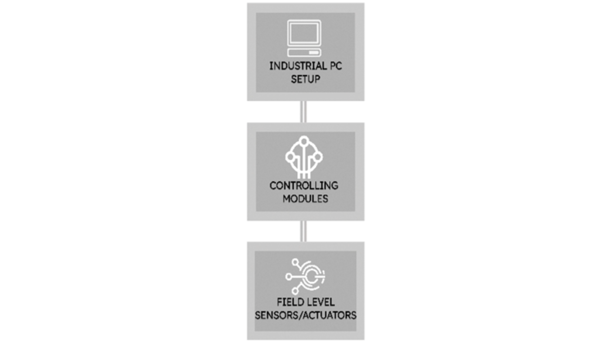

# Introduction

### Project overview 
This project involves the seamless integration of Industry 4.0 and IIoT (Industrial Internet of Things) technologies. 
It introduces an innovative method that utilizes IIoT-based hardware for real-time monitoring, specifically focusing on the analysis of voltage and Current Sensors.
A comprehensive series of tests was carried out to thoroughly to assess the performance of the IIoT-based hardware for monitoring welding machines in real-time. 

The experimental setup was comprised of eight welding machines, Hall effect sensors, voltage transducers, a Delta PLC DVP-12SE, Raspberry Pi, and associated components. Various voltage levels and current readings were the independent variables considered during the experiments.

### Project features 
* `Real-time Monitoring`: Special sensors capture
live data from welding machines.
  
* `Data Acquisition Module`: The collected data
goes to a central hub (Delta PLC DVP-12SE),
ensuring stable operation.
  
* `Integration with Raspberry Pi` : A Raspberry Pi
connects to the hub, facilitating seamless
integration of various systems and protocols.
  
* `Monitoring Dashboard` : Fast-API creates a user-
friendly dashboard, offering real-time insights
into welding parameters.
  
## IOT setup flowchart

The process involves acquiring data from the welding machine, transferring it to the local database, and displaying it within the software interface, as depicted in the accompanying flow chart and explanation

   

* At the field level, Hall effect sensors and voltage transducers are incorporated to capture real-time data from the welding machines.
  
* The collected data is then transmitted to the Delta PLC DVP-12E, which serves as the data acquisition module.
  
* The PLC is connected to a Rasberry Pi through an Ethernet connection. The Rasberry Pi acts as a bridge to a PostgreSQL database, acting as the central repository for all connected data.

* A local PC is employed as the endpoint for data access and analysis. It establishes a connection to the Rasberry Pi, allowing for the retrieval of the data from postgreSQL database.
  
* Fast-API is utilized as the framework for the monitoring dashboard, offering a platform for real-time monitoring of the welding parameters.