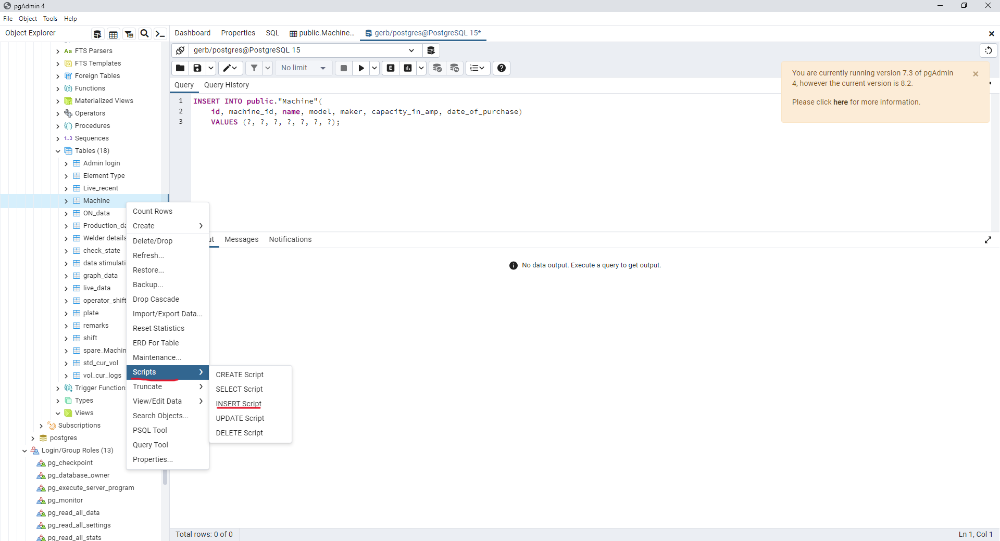
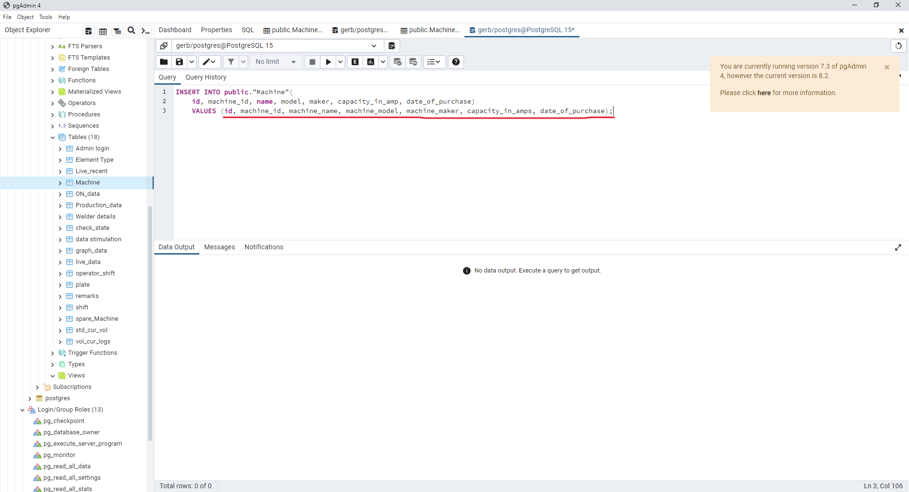
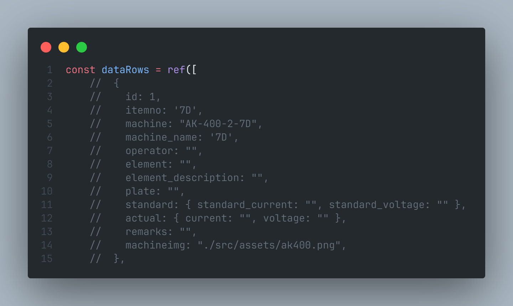
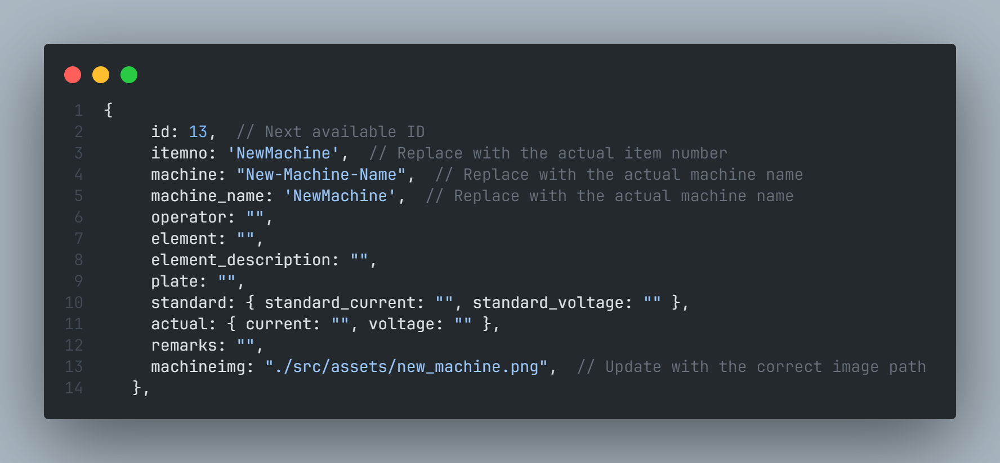

## Introduction

In this section of the documentation, you will find solutions addressing common issues that may arise.

###How to add a new machine?

####Backend

1. Navigate to the database, select the 'Schemas' tab, locate the 'Table' (Machine), right-click, and choose 'Script' to generate and insert the script.

  

2.Modify the values to reflect the appropriate data for the 'Machine' table.

  
  
####Frontend

To add a new machine to the existing `dataRows` array in your JavaScript code, follow these steps:

 

**1.  Identify the Next Available ID:**

* Find the last item in the `dataRows` array and determine its ID.
* Assign the new machine's ID as the next number after the last ID.

**2. Create a New Machine Object:**

* Copy one of the commented-out machine objects (e.g., the commented-out block for the 7D machine) as a template.
* Replace the placeholder values (e.g., '7D', 'AK-400-2-7D', etc.) with the actual values for the new machine.

**3. Update Image Path:**

* Replace the `machineimg` value with the correct path to the image for the new machine.

**4. Add the New Machine Object to dataRows:**

* Uncomment the copied machine object by removing the // from the beginning of each line.
* Add the new machine object to the `dataRows` array.

**5. Update Data Binding:**

* If your application relies on data binding, make sure to update the corresponding bindings in your application code to include the new machine data.
 
    

###How to use docker?
####Using Docker for Containerized Deployment

Follow these steps to build, tag, push, and run your Docker container:

1. **Build the Docker Image**:
   
         docker build -t <img_name>:<tag_name> .

    This command builds a Docker image using the Dockerfile in the current directory, tagging it with the specified image name and version.

2. **Tag the Docker Image:**

         docker tag <img_name>:<tag_name> <username>/<repo_name>:<tag>
    
    Tag the previously built image with your Docker Hub username, repository name, and desired version tag.

3. **Login to Docker Hub:**
    
    Ensure you are logged in to Docker Hub before pushing the image. Use the following command and follow the prompts.
    
        docker login
      
4. **Push the Docker Image:**
   
        docker push <username>/<repo_name>:<tag_name>

    Upload the tagged Docker image to your Docker Hub repository.

5. **Run the Docker Container:**

        docker run -e --name <container_name> -p <p_num>:<p_num> <username>/<repo_name>:<tag_name>

   Deploy a container from the specified image, setting environment variables and mapping ports as needed.

#####Key Points:
* Ensure you replace placeholders such as img_name, tag_name, username, repo_name, and container_name with your actual values.
* The -e option in the docker run command sets an environment variable in the container.
* Adjust the IP address, port mappings, and any other parameters based on your specific requirements.